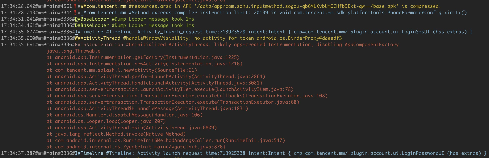

# aklog

Android developer's Swiss Army Knife for Log



### Installation

Run the following in your command-line:

```shell
$ brew tap wswenyue/aklog && brew install aklog
```

### Update

If you need to update，Run the command:

```shell
$ brew upgrade aklog
# or
$ brew uninstall aklog && brew untap wswenyue/aklog && brew tap wswenyue/aklog && brew install aklog
```

### How to use

```shell
$ aklog -h

usage: aklog.py [-h] [-v] [-pc | -pa | -p PACKAGE [PACKAGE ...] | -pn PACKAGE_NOT [PACKAGE_NOT ...]] [-tnf TAG_NOT_FUZZY [TAG_NOT_FUZZY ...] | -tn TAG_NOT [TAG_NOT ...]]
                [-t TAG [TAG ...] | -te TAG_EXACT [TAG_EXACT ...]] [-mn MSG_NOT [MSG_NOT ...]] [-m MSG [MSG ...] | -mjson MSG_JSON_VALUE [MSG_JSON_VALUE ...]] [-l LEVEL]
                [-cs [CMD_SCREEN_CAP] | -cr [CMD_RECORD_VIDEO]]

Android开发利器-AKLog-v5.0.4 (Android developer's Swiss Army Knife for Log)

optional arguments:
  -h, --help            show this help message and exit
  -v, --version         show program's version number and exit
  -pc, --package_current_top
                        匹配当前前台Top应用包名的日志,不加任何包名过滤条件时默认是此条件
  -pa, --package_all    不过滤,支持显示所有包名日志
  -p PACKAGE [PACKAGE ...], --package PACKAGE [PACKAGE ...]
                        匹配指定包名的日志,不需要填写完整包名,只要能区分即可
  -pn PACKAGE_NOT [PACKAGE_NOT ...], --package_not PACKAGE_NOT [PACKAGE_NOT ...]
                        排除指定包名的日志,支持数组
  -tnf TAG_NOT_FUZZY [TAG_NOT_FUZZY ...], --tag_not_fuzzy TAG_NOT_FUZZY [TAG_NOT_FUZZY ...]
                        模糊匹配tag并过滤掉不显示, 支持数组 eg: -tnf tag1 tag2
  -tn TAG_NOT [TAG_NOT ...], --tag_not TAG_NOT [TAG_NOT ...]
                        匹配tag并过滤掉不显示, 支持数组 eg: -tn tag1 tag2
  -t TAG [TAG ...], --tag TAG [TAG ...]
                        匹配tag, 支持数组 eg: -t tag1 tag2
  -te TAG_EXACT [TAG_EXACT ...], --tag_exact TAG_EXACT [TAG_EXACT ...]
                        匹配tag, 精准完全匹配, 支持数组 eg: -te tag1 tag2
  -mn MSG_NOT [MSG_NOT ...], --msg_not MSG_NOT [MSG_NOT ...]
                        匹配日志内容关键词并过滤掉不显示,支持数组 eg: -mn msg1 msg2
  -m MSG [MSG ...], --msg MSG [MSG ...]
                        匹配日志内容关键词,支持数组 eg: -m msg1 msg2
  -mjson MSG_JSON_VALUE [MSG_JSON_VALUE ...], --msg_json_value MSG_JSON_VALUE [MSG_JSON_VALUE ...]
                        匹配日志内容中JSON结构的数据,并获取指定key的值,例如 -mjson keyA keyB 将匹配带有"keyA"或"keyB"的json数据,并将对应的值解析出来
  -l LEVEL, --level LEVEL
                        匹配日志级别(V|v|2, D|d|3, I|i|4, W|w|5, E|e|6)
  -cs [CMD_SCREEN_CAP], --cmd_screen_cap [CMD_SCREEN_CAP]
                        命令:获取当前手机截屏,并保持到(传入的)指定位置,默认位置是:$~/Desktop/AkScreen/
  -cr [CMD_RECORD_VIDEO], --cmd_record_video [CMD_RECORD_VIDEO]
                        命令:开始录制当前手机视频,并保持到(传入的)指定位置,默认位置是:$~/Desktop/AkRVideo/

```