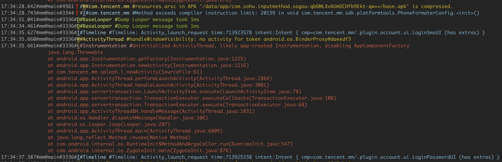

# aklog [](https://github.com/wswenyue/aklog/releases)

Android & HarmonyOS developer's Swiss Army Knife for Log



### 环境要求

通过 Homebrew 安装时，Python 与运行时依赖（`rich`、`argcomplete` 等）会自动处理，无需手动准备。

macOS 内置工具（可选；若已设置 SDK 环境变量则优先使用 SDK）：

- `lib/darwin/arm64/adb`、`lib/darwin/arm64/hdc` — Apple Silicon
- `lib/darwin/x86_64/adb`、`lib/darwin/x86_64/hdc` — Intel Mac

详见 [lib/README.md](lib/README.md)。Linux / Windows 请配置 `ANDROID_HOME` / `HARMONY_HOME`。

环境变量（可选）：

- `ANDROID_HOME` — 使用 SDK 中的 `platform-tools/adb`，而非内置 `adb`
- `HARMONY_HOME` — 使用 SDK 中的 `hdc`，而非内置 `hdc`

### 安装

```shell
brew tap wswenyue/aklog && brew install aklog
```

优先使用系统自带的 `python3`；若未安装，Homebrew 会自动安装 [python](https://formulae.brew.sh/formula/python) 作为依赖。运行时 Python 包（`rich`、`argcomplete`，以及 Python &lt; 3.11 下的 `tomli`）会在 `brew install` 时自动安装。

### Shell 补全

Tab 补全由 [argcomplete](https://github.com/kislyuk/argcomplete) 提供，可补全子命令、选项、日志级别，以及已连接设备的 ID（`-d`）。

**Homebrew：** 安装时自动配置 Shell 补全：

- zsh → `share/zsh/site-functions/_aklog`（`brew install aklog` 后重启 Shell）
- bash → `etc/bash_completion.d/aklog`（需要 [bash-completion](https://formulae.brew.sh/formula/bash-completion)；若尚未启用，请在 `~/.bash_profile` 中加入 `[[ -r "$(brew --prefix)/etc/profile.d/bash_completion.sh" ]] && . "$(brew --prefix)/etc/profile.d/bash_completion.sh"`）

### 更新

```shell
brew upgrade aklog
```

### 用法

```shell
aklog -h
aklog -d <device_id> -pc          # 指定设备，过滤前台应用日志
aklog cap-screen                   # 截图
aklog record-video                 # 录屏（Ctrl+C 停止）
aklog dump-log                     # 导出崩溃日志
aklog install -path ./app.hap      # 安装 hap/apk
aklog config init                  # 创建用户配色配置
aklog config path                  # 显示配置文件路径
```

多台 USB 设备同时连接（adb 和/或 hdc）时，若未指定 `-d`，aklog 会提示选择设备。

### 配置

用户配置保存在 `~/.config/aklog/config.toml`（Windows 为 `%APPDATA%\aklog\config.toml`）。

```shell
aklog config init      # 生成默认配色主题
aklog config path      # 打印配置文件路径
```

编辑 `[colors]` 可自定义各级别日志颜色。支持 [Rich](https://rich.readthedocs.io/en/stable/appendix/colors.html) 颜色名（如 `green`、`bright_blue`）及十六进制色值（如 `#ff6600`）。无效值会自动回退到内置默认配色。

每个日志级别包含两个颜色字段：

| 字段 | 说明 |
|------|------|
| `base` | 级别标签底色（如 `DEBUG`、`INFO`） |
| `tag` | 日志 Tag 与消息正文颜色 |

#### 常用 Rich 颜色名

**基础色（16 色）：**

| 颜色名 | 说明 | 颜色名 | 说明 |
|--------|------|--------|------|
| `black` | 黑 | `white` | 白 |
| `red` | 红 | `bright_red` | 亮红 |
| `green` | 绿 | `bright_green` | 亮绿 |
| `yellow` | 黄 | `bright_yellow` | 亮黄 |
| `blue` | 蓝 | `bright_blue` | 亮蓝 |
| `magenta` | 品红 | `bright_magenta` | 亮品红 |
| `cyan` | 青 | `bright_cyan` | 亮青 |

**灰色系：**

| 颜色名 | 说明 |
|--------|------|
| `grey0` ~ `grey100` | 灰度渐变（数字越大越浅） |
| `grey50` | 中灰（默认 meta 色） |
| `grey62` | 浅灰（默认 verbose tag 色） |

**常用扩展色（X11）：**

| 颜色名 | 色调 | 颜色名 | 色调 |
|--------|------|--------|------|
| `dark_sea_green2` | 暗海绿 | `spring_green2` | 春绿 |
| `steel_blue3` | 钢蓝 | `indian_red` | 印度红 |
| `dark_goldenrod` | 暗金 | `orange3` | 橙 |
| `purple3` | 紫 | `violet` | 紫罗兰 |
| `deep_pink3` | 深粉 | `turquoise2` | 青绿 |

**十六进制色值：**

任意 `#RRGGBB` 格式均可使用，例如 `#ff6600`（橙）、`#00bcd4`（青）、`#e91e63`（粉）。

#### 预设配色方案

以下方案可直接复制到 `config.toml` 的 `[colors]` 段落中使用。

**默认（内置）：**

```toml
[colors]
meta = "grey50"
level_style = "bold"
tag_style = "bold underline"
msg_style = "bold"

[colors.verbose]
base = "grey50"
tag = "grey62"

[colors.debug]
base = "dark_sea_green3"
tag = "aquamarine1"

[colors.info]
base = "steel_blue3"
tag = "bright_blue"

[colors.warn]
base = "dark_goldenrod"
tag = "bright_yellow"

[colors.error]
base = "light_coral"
tag = "indian_red1"
```

**高对比（深色终端友好）：**

```toml
[colors]
meta = "grey62"

[colors.verbose]
base = "grey50"
tag = "grey70"

[colors.debug]
base = "green"
tag = "bright_green"

[colors.info]
base = "blue"
tag = "bright_cyan"

[colors.warn]
base = "yellow"
tag = "bright_yellow"

[colors.error]
base = "red"
tag = "bright_red"
```

**柔和（护眼）：**

```toml
[colors]
meta = "grey58"

[colors.verbose]
base = "grey50"
tag = "grey62"

[colors.debug]
base = "dark_sea_green3"
tag = "aquamarine1"

[colors.info]
base = "steel_blue"
tag = "deepskyblue1"

[colors.warn]
base = "dark_goldenrod2"
tag = "gold1"

[colors.error]
base = "indian_red1"
tag = "light_coral"
```

**Material 风格：**

```toml
[colors]
meta = "#9e9e9e"

[colors.verbose]
base = "#757575"
tag = "#bdbdbd"

[colors.debug]
base = "#388e3c"
tag = "#69f0ae"

[colors.info]
base = "#1976d2"
tag = "#40c4ff"

[colors.warn]
base = "#f57c00"
tag = "#ffd740"

[colors.error]
base = "#c62828"
tag = "#ff5252"
```

### 平台对照

| 功能 | Android (adb) | HarmonyOS (hdc) |
|------|---------------|-----------------|
| 日志流 | logcat | hilog |
| 前台过滤 | dumpsys | aa dump |
| 截图 | screencap | snapshot_display |
| 录屏 | screenrecord | system screenrecorder |
| 崩溃导出 | dropbox | faultlogger |
| 安装 | adb install | hdc install |

**说明：** HarmonyOS 录屏需要已解锁的实体设备，且系统录屏服务可用。
